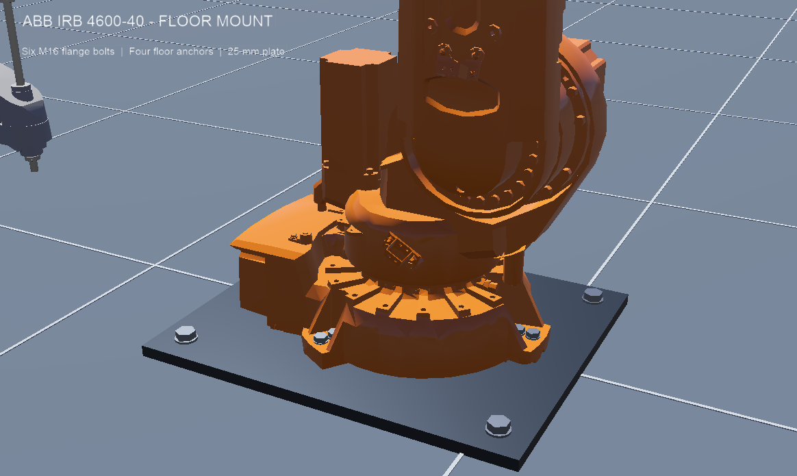

# Floor-mounted SCARA and ABB robot world

Open `worlds/scara_robot.wbt` in Webots R2025a. Both robots are fixed to steel floor plates. The floor is 10 m × 10 m, with a 1 m grid.

## Scale

The original scene already used Webots' metre-based robot models. Their native mesh, joint and collision dimensions are retained, with no extra scale transform. The ABB is substantially larger than the SCARA in real life too.

| Item | Dimension |
| --- | --- |
| Epson T6-602S | Manufacturer's nominal reach: 600 mm |
| ABB IRB 4600-40/2.55 | Manufacturer's nominal reach: 2.55 m |
| Floor | 10 m × 10 m |
| Grid square | 1 m × 1 m |
| SCARA plate | 340 × 280 × 12 mm |
| ABB plate | 840 × 700 × 25 mm |

The robot models are the supplied Webots approximations, not newly calibrated manufacturer CAD. Nominal reach values identify the real robots; they are not claims of a newly measured simulated workspace. For example, the stock SCARA's mounting-hole spacing and kinematic offsets differ slightly from the Epson drawings. The visible flange bolts follow the supplied mesh holes. Plate dimensions and floor anchors are scene design choices.

## How the robots are bolted down

1. `staticBase TRUE` on **both** robot instances fixes each root base to Webots' static environment. The arm joints remain movable. Visible bolts alone would not fix a robot in the physics simulation.
2. `GroundMount.proto` adds fixed steel plates with collision boxes and four visible floor anchors per plate. The plates have no `Physics` node, so they cannot fall or slide.
3. `FlangeBolts.proto` adds four M8-size bolts at the SCARA base and six M16-size bolts at the ABB base, aligned with the existing mesh holes.
4. Base heights are calculated from the plate top and the mesh underside:
   - SCARA: `0.012 - (-0.009037) = 0.021037 m`.
   - ABB: `0.025 - (-0.000003) = 0.025003 m`.
   - The SCARA's simplified collision box extends about 2 mm below its visible mesh; its fixed base overlaps the static plate by that amount.
5. `MetricGrid.proto` draws the metre grid. The original 10 m floor size is retained, with a plain industrial floor appearance replacing the checker texture.
6. `hold_pose.py` holds the robots at their initial joint positions. It replaces sample controllers that required missing factory objects or an incompatible inverse-kinematics setup. No third-party Python libraries are needed.

The original world is backed up in `worlds/scara_robot.original.wbt.bak`.

## Verification

The generated mounting-check world commands the SCARA and ABB base joints through approximately −0.199 to +0.199 radians, then returns them to the initial pose. Across 12 simulated seconds, both base position/orientation matrices had **zero measured change**. Both controllers ran successfully. Results are saved in `docs/mount-check.json`.

Webots still reports a large mass ratio between the stock ABB link and a 0.001 kg intermediate SCARA link. This comes from the supplied robot physics. The mounting check passes, but it does not certify all possible high-speed motions, payloads or collision conditions.

To regenerate the check world:

```sh
python3 scripts/prepare_mount_check.py
```

Open `worlds/.mount_check.wbt` in Webots and press Run. The check exports the images below and pauses after completion. Open `worlds/scara_robot.wbt` again for the normal pose-holding scene. For an automated run that exits afterward, pass `--quit` to the preparation script and start Webots with `--batch --mode=fast --stdout --stderr` and the generated world path.

## Views





## References

- [Epson T-series manual: T6 dimensions and nominal reach](https://download.epson.biz/robots/data/us/English/T_Robot.pdf)
- [ABB robot specifications: IRB 4600-40/2.55](https://library.e.abb.com/public/04e8359da4716f0dc1257d1f00392730/ABB_PR10290EN_R14_Master.pdf)
- [ABB IRB 4600 mounting screws](https://library.e.abb.com/public/b12745f41a15419c9228b3ccd314935e/3HAC033453%20PM%20IRB%204600-en.pdf)
- [Webots SCARA model and staticBase implementation](https://github.com/cyberbotics/webots/blob/R2025a/projects/robots/epson/scara_t6/protos/ScaraT6.proto)
- [Webots ABB model and staticBase implementation](https://github.com/cyberbotics/webots/blob/R2025a/projects/robots/abb/irb/protos/Irb4600-40.proto)
