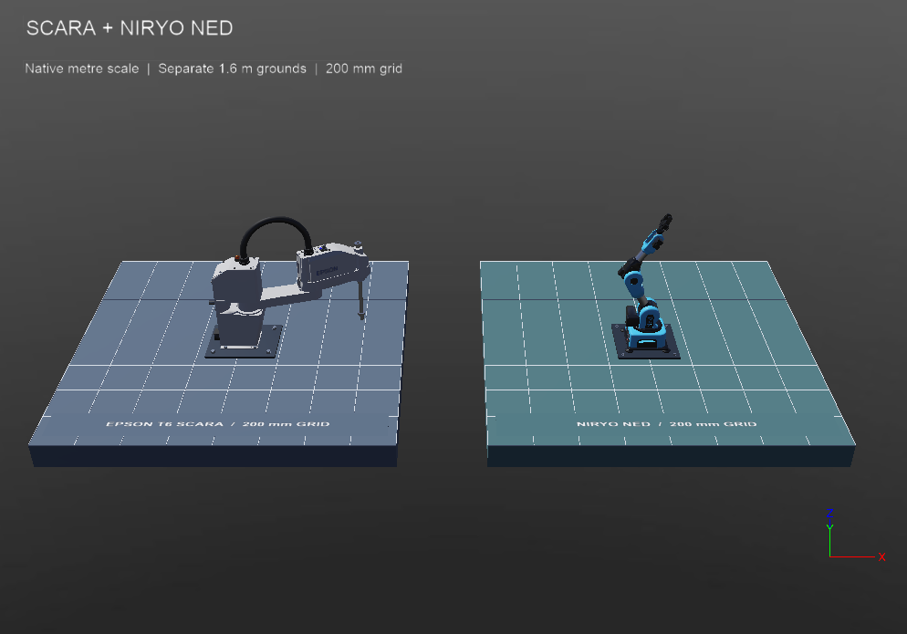
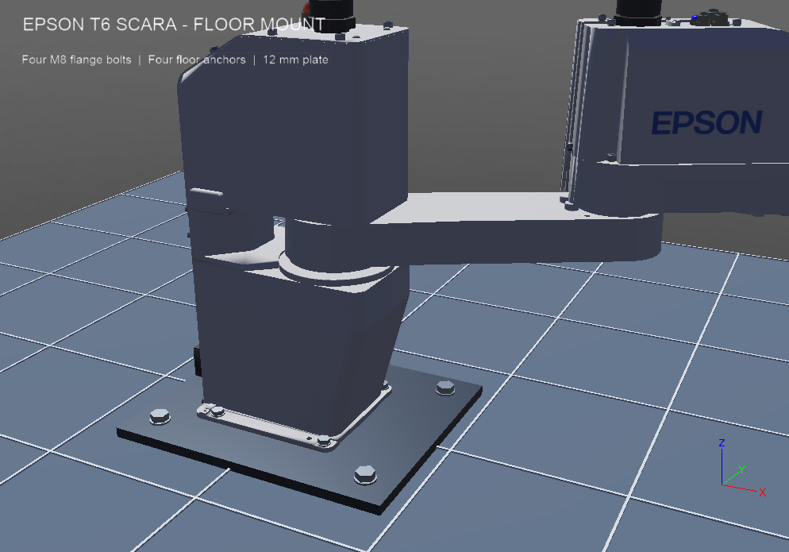
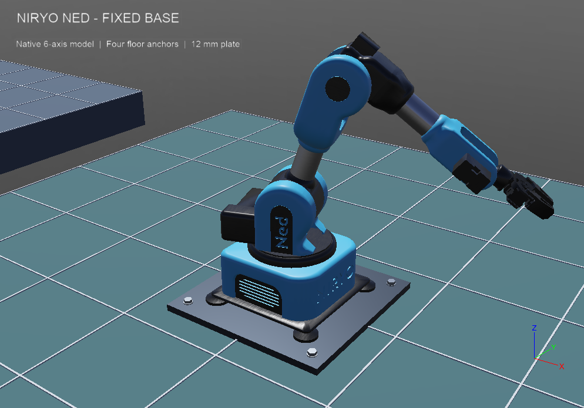
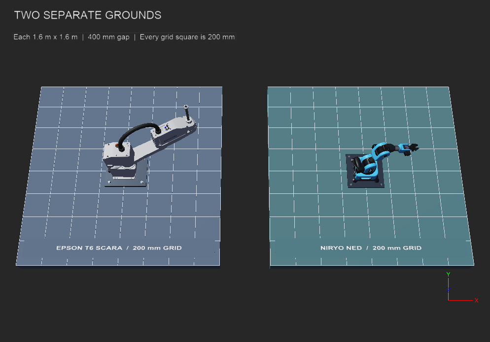

# SCARA and Niryo Ned on separate grounds

Webots scene containing an Epson T6-602S SCARA and the **original Niryo Ned**, each on a separate, fixed ground slab and steel mounting plate. Niryo Ned replaces the ABB arm in the active world.



## Getting started

Requirements: Webots R2025a and Python 3 configured as Webots' Python interpreter. The controllers use Webots' bundled Python API and the Python standard library. Internet access is needed to download any referenced Webots models and assets that are not already cached.

1. Open [worlds/scara_robot.wbt](worlds/scara_robot.wbt) in Webots.
2. Press **Run / Real-time**. Both robots hold their initial joint positions.
3. Use the labelled 200 mm grids to compare the robots at the same scale. The SCARA is on the left ground and Ned is on the right.

On macOS, you can also launch the scene from the project directory:

```sh
/Applications/Webots.app/Contents/MacOS/webots --mode=realtime worlds/scara_robot.wbt
```

## Real-world scale

Both robots use the official Webots R2025a models at their native metre scale. No enlargement, shrinkage or mesh scale transform is applied. Meshes, joint offsets, collision shapes and moving-link physics are unchanged.

| Item | Dimension |
| --- | --- |
| Each separate ground | 1.6 × 1.6 m, 120 mm thick |
| Clear gap between grounds | 400 mm |
| Grid square | 200 × 200 mm |
| Robot base origin separation | 2 m |
| SCARA mounting plate | 340 × 280 × 12 mm |
| Ned mounting plate | 300 × 300 × 12 mm |
| Ned model base including feet | Approximately 220 × 220 mm |

These are the supplied simulation models, not newly calibrated manufacturer CAD. Ground and mounting plate dimensions are scene design choices. The Ned model is the original Ned, not Ned2 or Ned3 Pro.

## Ground and mounting

- `RobotGround.proto` creates each slab as an independent static solid with its own collision box. There is no shared floor beneath or across the gap.
- The top of each ground is at z = 0; the slab extends down to z = −0.12 m. Each has a 200 mm grid and robot label.
- `GroundMount.proto` adds fixed steel plates and four visible ground anchors per plate. The SCARA retains its four visible M8 flange bolts.
- The SCARA uses `staticBase TRUE`. The official Ned model already has a static root because its root Robot has no `Physics` node; its articulated links remain movable.
- The SCARA base origin is at z = 0.021037 m, matching its mesh underside (−0.009037 m) to the 12 mm plate top. Its simplified collision box overlaps the plate slightly, as in the original scene.
- The Ned base origin is at z = 0.0125 m, matching its mesh underside (−0.0005 m) to the 12 mm plate top. Its four rubber feet and base are retained unchanged. The robot is rotated 90° about the vertical axis for a clear side view.
- `hold_pose.py` holds every motor at its initial zero joint position. Neither controller needs third-party Python packages.

The original scene remains backed up in `worlds/scara_robot.original.wbt.bak`.

## Verification

The latest [mounting check](docs/mount-check.json) **passed**. It exercised the joints for 12 simulated seconds and confirmed that both ground slabs are separate, fixed collision solids.

| Check | SCARA | Niryo Ned |
| --- | --- | --- |
| Maximum measured change in base pose | 0 | 0 |
| Measured base joint range | −0.199 to +0.199 rad | −0.199 to +0.199 rad |
| Detected motors | 4 | 8: six arm joints and two gripper motors |
| Ground size | 1.6 × 1.6 m | 1.6 × 1.6 m |

The measured gap between the grounds is 0.4 m. This check verifies the scene's mounting and joint motion; it does not calibrate the models against physical robots.

Generate the validation world:

```sh
python3 scripts/prepare_mount_check.py
```

Open `worlds/.mount_check.wbt` in Webots and press Run. The check exports the views below and pauses after completion. Reopen `worlds/scara_robot.wbt` for the normal pose-holding scene.

For a batch check on macOS, run these commands from the project directory:

```sh
python3 scripts/prepare_mount_check.py --quit
/Applications/Webots.app/Contents/MacOS/webots --batch --mode=fast --stdout --stderr worlds/.mount_check.wbt
```

This prints `MOUNT CHECK PASS` or `MOUNT CHECK FAIL`, updates the report and screenshots, then exits Webots with the corresponding success or failure status. On other platforms, replace the application path with your Webots executable.

## Project files

| File | Purpose |
| --- | --- |
| [worlds/scara_robot.wbt](worlds/scara_robot.wbt) | Main scene, robot placement and overview camera |
| [protos/RobotGround.proto](protos/RobotGround.proto) | Separate ground slabs, grids and labels |
| [protos/GroundMount.proto](protos/GroundMount.proto) | Steel mounting plates and visible ground anchors |
| [protos/MetricGrid.proto](protos/MetricGrid.proto) | Metric grid markings |
| [protos/FlangeBolts.proto](protos/FlangeBolts.proto) | SCARA flange fasteners |
| [controllers/hold_pose/hold_pose.py](controllers/hold_pose/hold_pose.py) | Pose holding and optional joint exercise |
| [controllers/check_mounts/check_mounts.py](controllers/check_mounts/check_mounts.py) | Mounting checks, report and screenshot export |
| [scripts/prepare_mount_check.py](scripts/prepare_mount_check.py) | Generates the validation world from the main scene |

## Views







## Model sources

- [Webots R2025a Niryo Ned: original model, joint geometry and static root](https://github.com/cyberbotics/webots/blob/R2025a/projects/robots/niryo/ned/protos/Ned.proto)
- [Ned base mesh: native dimensions including rubber feet](https://github.com/cyberbotics/webots/blob/R2025a/projects/robots/niryo/ned/protos/meshes/base_link_4.obj)
- [Webots R2025a SCARA and staticBase implementation](https://github.com/cyberbotics/webots/blob/R2025a/projects/robots/epson/scara_t6/protos/ScaraT6.proto)
- [Epson T-series manual](https://download.epson.biz/robots/data/us/English/T_Robot.pdf)
